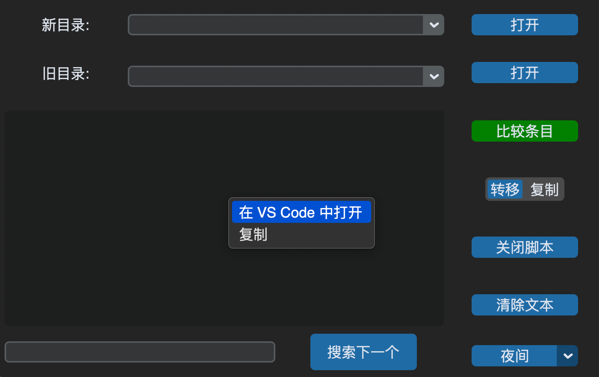

# 介绍

# 功能

- 集成文本框，重定向标准io流
- 嵌入 cmd
- 文本框搜索，并对搜索内容高亮
- 多进程与多线程
- 关闭脚本进程
- 清空文本框内容
- 记忆功能，包括目录路径、窗口尺寸和位置、主题
- 鼠标悬停在路径上时可在右键菜单中选择在 VS Code 打开文件（需将 code 命令加入环境变量）
- 选择部分文本框内容或在鼠标悬停时复制
- 交互限制，限制输入内容、限制重复运行脚本

# 下载

见 [Release](https://github.com/Areuhw/compare-entries/tags)

# 使用

目录旁边有一个下拉菜单会显示最近打开的10个路径。程序运行会在所在目录生成`data.json`，里面保存了上次退出程序时的窗口尺寸等数据。

## 鼠标

左键：取消文本框内容选择、取消搜索高亮、聚焦于文本框或搜索框

右键：在文本框中弹出菜单

悬停：在文本框中高亮段落

## 键盘

Y/n：选择是否执行文件操作

O/p：选择将比较结果输出到文件/打印到文本框

BackSpace：删除输入的cmd命令

Help/?：显示命令帮助

回车：在文本框中输入命令后确认、在搜索框中输入内容后进行搜索

r：取消/开启悬停高亮

control + f：聚焦于搜索框

# 协议

此项目使用 [CC BY-SA 4.0](https://creativecommons.org/licenses/by-sa/4.0/legalcode.zh-hans) 协议。第三方材料协议见 [THIRD_PARTIES](/THIRD_PARTIES.md).
